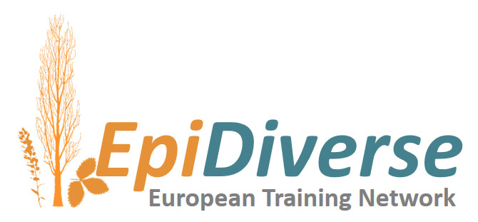

[](https://ec.europa.eu/programmes/horizon2020/en)
[](https://epidiverse.eu)
[](https://www.nextflow.io/)
[](http://bioconda.github.io/)
[](https://hub.docker.com/r/epidiverse/snp)

EpiDiverse-SNP Pipeline
========================

**EpiDiverse/snp** is a bioinformatics analysis pipeline for calling single nucleotide polymorphism variants from bisulfite sequencing data and/or for clustering of eg. environmental plant samples according to their methylation profiles while masking the genomic variation.

The workflow pre-processes a collection of bam files from the [EpiDiverse/WGBS](https://github.org/epidiverse/wgbs) pipeline using [samtools](https://github.com/samtools/samtools), then masks genomic and/or bisulfite variation relative to the reference using custom scripts. Genomic masked alignments are then extracted into fastq format and tested for kmer diversity using [kWIP](https://kwip.readthedocs.io/en/latest/) for clustering groups. Bisulfite-masked alignments are taken forward for variant calling using a combination of [Freebayes](https://github.com/ekg/freebayes) and post-call filtering with [bcftools](https://github.com/samtools/bcftools).

> See the [output documentation](docs/output.md) for more details of the results.

The pipeline is built using [Nextflow](https://www.nextflow.io), a workflow tool to run tasks across multiple compute infrastructures in a very portable manner. It comes with docker containers making installation trivial and results highly reproducible.

## Quick Start

i. Install [`nextflow`](https://www.nextflow.io/)

ii. Install one of [`docker`](https://docs.docker.com/engine/installation/), [`singularity`](https://www.sylabs.io/guides/3.0/user-guide/) or [`conda`](https://conda.io/miniconda.html)

iii. Download the pipeline and test it on a minimal dataset with a single command

```bash
nextflow run epidiverse/snp -profile test,<docker|singularity|conda>
```

iv. Start running your own analysis!

```bash
nextflow run epidiverse/snp -profile <docker|singularity|conda> --input /path/to/wgbs/directory
```

> See the [usage documentation](docs/usage.md) for all of the available options when running the pipeline.

### Wiki Documentation

The EpiDiverse/snp pipeline is part of the [EpiDiverse Toolkit](https://app.gitbook.com/@epidiverse/s/project/epidiverse-pipelines/overview), a best practice suite of tools intended for the study of [Ecological Plant Epigenetics](https://app.gitbook.com/@epidiverse/s/project/). Links to general guidelines and pipeline-specific documentation can be found below:

1. [Installation](https://app.gitbook.com/@epidiverse/s/project/epidiverse-pipelines/installation)
2. Pipeline configuration
    * [Local installation](https://app.gitbook.com/@epidiverse/s/project/epidiverse-pipelines/installation#2-install-the-pipeline)
    * [Adding your own system config](https://app.gitbook.com/@epidiverse/s/project/epidiverse-pipelines/installation#3-pipeline-configuration)
    * [EpiDiverse infrastructure](https://app.gitbook.com/@epidiverse/s/project/epidiverse-pipelines/installation#appendices)
3. [Running the pipeline](docs/usage.md)
4. [Understanding the results](docs/output.md)
5. [Troubleshooting](https://app.gitbook.com/@epidiverse/s/project/epidiverse-pipelines/troubleshooting)

### Credits

These scripts were originally written for use by the [EpiDiverse European Training Network](https://epidiverse.eu/), by Adam Nunn ([@bio15anu](https://github.com/bio15anu)).

This project has received funding from the European Union’s Horizon 2020 research and innovation
programme under the Marie Skłodowska-Curie grant agreement No 764965

## Citation

If you use epidiverse/snp for your analysis, please cite it using the following doi: <placeholder>