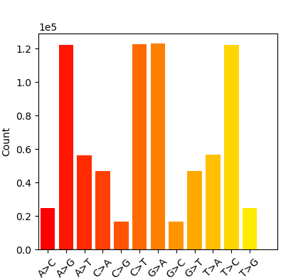
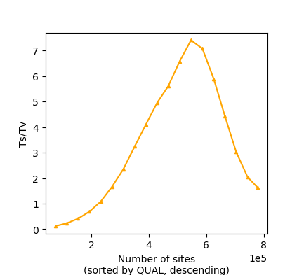
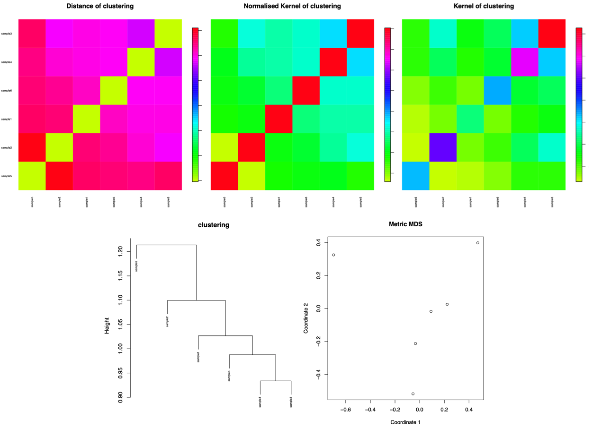

# EpiDiverse-SNP Output
This document describes the output produced by the pipeline.

## Pipeline overview
The pipeline is built using [Nextflow](https://www.nextflow.io/) and processes data using the following steps:

* [Masking](#masking) -Preparing bam files for variant calling and/or clustering
* [Variant calling](#variant-calling) -Variant calling on bisulfite sequencing data
* [khmer and kWIP](#khmer-and-kwip) -Sample clustering based on k-mer similarity

### Output Directory Structure


## Masking
After preprocessing input alignments (sort,calmd,index), nucleotide masking is performed either on bisulfite-converted positions or any genomic variation apparent in non-bisulfite contexts depending on whether the alignments should be used for variant calling, or sample clustering by k-mer similarity, respectively.

**Output directory: `snps/bam/{clusters,variants}/`**

* `*.bam`
  * **NB:** Only saved if corresponding modes `--clusters` and/or `--variants` specified during pipeline run.


## Variant calling
Variant calling is performed with Freebayes, on whole genome bisulfite sequencing data which has been masked in bisulfite contexts and can be thus interpreted as normal sequencing data. Statistics are estimated with `bcftools stats` and plotted with `plot_vcfstats`.

**Output directory: `snps/vcf/`**

* `*.vcf.gz`
  * The full results from Freebayes (parallel), run using the following options:
    * `--no-partial-observations`
    * `--report-genotype-likelihood-max`
    * `--genotype-qualities`
    * `--min-repeat-entropy <ARG>`
    * `--min-coverage <ARG>`

**Output directory: `snps/stats/[SAMPLE]/`**

* `substitutions.png`
  * Overall counts for each substitution type.



* `tstv_by_qual.png`
  * Overall transition/transversion ratio and counts by descending QUAL score




## khmer and kWIP
If `--clusters` has been specified during the pipeline run, then reads will be extracted from corresponding alignment files masking genomic variation, and 

**Output directory: `snps/`**

* `clustering.pdf`
  * Plots based on distance and kernel metrics from kWIP



* `kern.txt`
```
	sample4	sample2	sample5	sample1	sample6	sample3
sample4	1.34604e+07	6.22459e+06	4.36788e+06	4.66799e+06	5.61053e+06	8.39729e+06
sample2	6.22459e+06	1.20348e+07	2.69173e+06	3.49371e+06	4.32674e+06	7.43909e+06
sample5	4.36788e+06	2.69173e+06	8.6747e+06	2.83771e+06	3.45439e+06	4.39799e+06
sample1	4.66799e+06	3.49371e+06	2.83771e+06	6.48395e+06	3.57604e+06	5.13139e+06
sample6	5.61053e+06	4.32674e+06	3.45439e+06	3.57604e+06	8.81986e+06	6.17416e+06
sample3	8.39729e+06	7.43909e+06	4.39799e+06	5.13139e+06	6.17416e+06	1.64687e+07
```

* `dist.txt`
```
	sample4	sample2	sample5	sample1	sample6	sample3
sample4	0	1.01088	1.09159	1.00033	0.984962	0.933808
sample2	1.01088	0	1.21372	1.09954	1.07707	0.971175
sample5	1.09159	1.21372	0	1.11501	1.10007	1.12432
sample1	1.00033	1.09954	1.11501	0	1.02676	1.00342
sample6	0.984962	1.07707	1.10007	1.02676	0	0.987631
sample3	0.933808	0.971175	1.12432	1.00342	0.987631	0
```

* `hashes/*.ct.gz`
  * K-mer hashes for individual samples, derived from khmer 


## Pipeline Info
Nextflow has several built-in reporting tools that give information about the pipeline run.

**Output directory: `template/`**

* `dag.svg`
  * DAG graph giving a diagrammatic view of the pipeline run.
  * NB: If [Graphviz](http://www.graphviz.org/) was not installed when running the pipeline, this file will be in [DOT format](http://www.graphviz.org/content/dot-language) instead of SVG.
* `report.html`
  * Nextflow report describing parameters, computational resource usage and task bash commands used.
* `timeline.html`
  * A waterfall timeline plot showing the running times of the workflow tasks.
* `trace.txt`
  * A text file with machine-readable statistics about every task executed in the pipeline.
